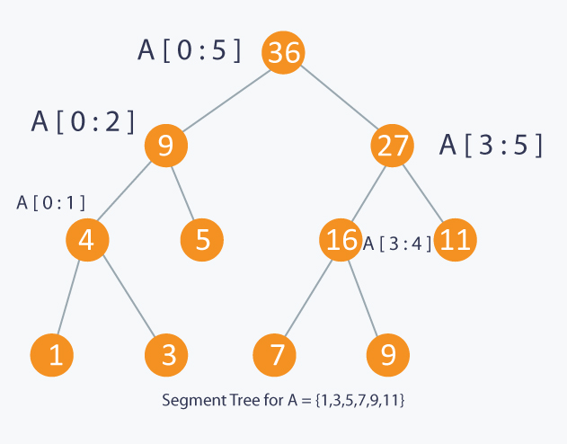

# Notes

## Sorting
* Comparison based: O(nlogn) ~ O(n^2)
	* Quick Sort, Merge Sort, Heap Sort, Bubble sort...
* Counting based: O(k+n)
	* Counting sort: O(k+n)
		* all elements in array are in range [0, k)
		* foundamental step of radix sort
		* it is **Stable**
		* implementation
			* counter map for counting occurance of elements with same value in the input array; resulting array for stableness
			* calculate the max index of each element presented in counter map
			* output the resulting elements to resulting array from their max indices reversely
	* Radix sort: O(d*n)
		* all elements are at most d digits
		* sort from least to most significant digit: less intermediate results
		* require stable sorting alg for each digit sorting
	* Bucket sort
		* elements are distributed evenly in buckets
		* it is **Stable**
		* buckets are sorted, elements in each bucket are sorted respectively

## B Tree
* B Tree: worst case O(tlogtn)
	* Minimum degree constraint: 
		* for non-root node: t-1 <= #keys <= 2t-1 
		* for non-root internal node: t <= #children <= 2t 
	* Balanced: all leaves have the same depth, which is the height of tree: h <= logt(n+1)/2
	* Hierarchical: good for cache/index implementation - architecture leverage of different kinds of storage
	* Fast node insertion or deletion: O(tlogtn)
	* Grow upwards: Only when root is full and a split is performed at root will a B tree increase its height; other split does not affect the height

* Implementation: 
	* One pass downward without backtrack: adjust node on the path during insertion and deletion before the constraint breaks.
	* Node type needs to be adjust:
		* full node: node with #keys = 2t-1
		* 'empty' node: node with #keys = t-1 (it's not empty actually, but I use empty in contrast with full node)
	* Basic node adjust operation
		* Decrease #key of a full node for a safe insertion
			* split a intermediate node: turn a full node into 2 'empty' node, and elevate 1 key into parent
			* split root: intrduce new root, and height + 1
		* Increase #key of a 'empty' node for a safe deletion
			* borrow key from sibling: push down a key from its parent to the 'empty' node, at the same time move a key of one of its sibling who is not 'empty' to parent
			* merge with sibling: merge the 'empty' node with one of its sibling who is also 'empty', and the merged node has 2t-1 keys (the key in the parent between the 2 node is pushed down to the merged node also)
	* Code complexity: 
		* insertion: remember to split any full node on search path
		* deletion: much more complicated, but the basic rule is to adjust the 'empty' node before make any delete, and recursively do the deletion

## Red Black Tree
* RBT: O(logn)
	* Properties
		1. Every node is either red or black.
		2. The root is black.
		3. Every leaf (NIL) is black.
		4. If a node is red, then both its children are black.
		5. For each node, all simple paths from the node to descendant leaves contain the same number of black nodes. 
	* Balanced: no path is twice as long as others. h <= 2log(n+1)
* Left Lean RBT: Only left child can be red
	* LLRBT is equavalent to 2-3/2-3-4 tree (B tree with minimum degree = 2)
	* It has simpler implementation
* Implementation
	* rotation: left rotate and right rotate helps to reshape a subtree
	* insert: insert as BST, and make the node red, do insert fix up for red parent-child case (property 4)
	* delete: delete as BST, do insert fix up for bh imbalance case (property 5)
	

## Order Statistics Tree
* OS Tree: dynamic order statistic with O(logn)
	* operations supported: select the ith element, rank of a element
	* augment of RBT
			* size: # of nodes in subtree

		
## Interval Tree
* Interval Tree: find overlap of intervals with O(logn)
	* operations supported: find an overlap interval of the given interval
 	* augment of RBT
	 	* left end of interval as key
		* max right: max right end in the subtree

## van Emde Boas Tree
* van Emde Boas Tree: priority queue operations in O(loglogu)
	* Optimized bitmap: NO sort needed
	* Keys are integers in range [0, u) with no duplicate
	* SEARCH, INSERT, DELETE, MINIMUM, MAXIMUM, SUCCESSOR, and PREDECESSOR in O(loglogu)
	* Data structure
		* size: range
		* min: minimum element in subtree
		* max: maximum element in subtree
		* cluster: each vEB node of size u has a cluster of size u1/2 in which each cluster node is a vEB node of size u1/2.
		* summary: each vEB node has a summary for its cluster, indicating which cluster has elements.
	* The cluster hierarchical structure decrease the height
	* The summary helps to locate the non-null cluster fast so that we can jump around

vEB tree with elements [2, 3, 4, 5, 7, 14, 15]

## Union-Find Set
* union-find set: Build MCC in O(V+E)
	* Construct MCC(max connected component) dynamically: repeatedly find and union
		* union(x, y): union the set contains x and the set contains y
		* find-set(x): find the representative of set contains x
	* Implementation
		* Represent set as rooted tree: each node has a pointer to its parent
		* Keep counter 'rank' as # of elements in the set
	* Optimization
		* Union by rank: during union operation, link set with higher rank to set with lower rank
		* Path compression: during find-set, flatten the tree by make each node in the tree directly point to the root
* Problems:
	* [driving problem](https://www.lintcode.com/problem/driving-problem/description)

## Priority Queue
* Heap: O(logn)
	* Min-Heap: H(i) < H(leftChild(i)) and H(i) < H(rightChild(i))
	* support operations: extractMin (O(logn)), insert (O(logn)), decreaseKey(O(logn))
	* Implementation
		* foundamental operation: 
			* minHeapify(i)/siftDown(i) to adjust a subheap rooted i and keep the min-heap requirement
			* decreaseKey(i, K)/siftUp(i) to adjust the heap above i and keep the min-heap requirement
		* operations like build-heap and heap-sort are based on the foundamental operations and swap

## Binary Indexed Tree
* Binary Indexed Tree: Optimized for sub-array sum
	* operations: O(logn) for prefix sum query, range sum query; O(logn) for array update
	* idea: 
		* Array based tree index: 1-based index array BIT
		* ranges of input array A are indexed by BIT: 
			* BIT(n) = A[n - 2r + 1] +...+ A[n], where r is the # of trailing 0s of n
			* Prefix_sum(n): constantly remove rightmost 1 of n's binary representation, and sum BIT(n)
				* prefix_sum(1011) = BIT(1011) + BIT(1010) + BIT(1000)
	* implementation:
		* quick remove rightmost 1 of n's binary representation with O(1): n - (n & (-n))
	* application: range sum query, count 1s in bitmap

* Reference:
	* [Topcoder](http://community.topcoder.com/tc?module=Static&d1=tutorials&d2=binaryIndexedTrees)
	* [Chinese translation](http://www.hawstein.com/posts/binary-indexed-trees.html)

## Segment Tree
* Segment Tree: Optimized for sub-array count, min/max, sum
	* operations: O(logn) for range query ; O(logn) for array update
	* Idea: 
		* index ranges of input array
		* For a range query, find the indexed ranges that added up to the range
	* SegmentTree vs. Binary Indexed Tree
		* indexing the ranges of input array
			* Segment tree index is built top-down, it has to be rebuilt when input array size changes.
			* BIT index is built bottom-up, it's extensible with input array size changes.
		* Space
			* Segment Tree requires O(2n)
			* BIT requires O(n+1)
		* Implementation
			* BIT has less code than segment tree
	* application: RMQ (Range Minimum Query)
		* [Count of Smaller Numbers After Self](https://www.lintcode.com/problem/count-of-smaller-numbers-after-self)

## Persistent Segment Tree
* Segment tree with version info
	* Online range query each in O(logn)
	* Each update generates a version: a new root and logn new nodes
* Application
	* kth largest element in a range [a, b]: [Online kth number](https://www.spoj.com/problems/MKTHNUM/) 
		* use rank as segment tree index, the prefix sum of segment tree at version a `ps[a][i]` means how many elements in rank [0, i] and range[0, a]
		* compare between 2 versions and find the rank i which (ps[b][i] - ps[a][i]) == k
	* The # of different prefixes of an array of strings in a range [a, b]: [hdu5790](https://blog.csdn.net/CZWin32768/article/details/52121892)
		* Each segment tree at version b stores following info for each strings i before b - how many different prefixes are there between string b and string i
		* the answer for each online query of range [a, b]: ps[b][a]
	* [Sets of intervals](https://codeforces.com/contest/1080/problem/F)
	* [Count on a Tree](https://www.spoj.com/problems/COT/)

* Reference: 
	* [CodeForces1](https://codeforces.com/blog/entry/15729)
	* [CodeForces2](https://codeforces.com/blog/entry/15890)

## Mergeable Heap
* Mergeable heap:
	* support oprtations: insert, minimum, extractMin, union, deceaseKey, delete
	* usally bad performance for search operation
* Binomial heap: worst case O(logn)
	* Binomial tree Bk: 2 Bk-1 binomial subtrees for which take 1 subtree's root as the other subtree's left child
		* height k = logn
		* The root of Bk has degree k which corresponding to k children from left to right: Bk-1, Bk-2, ..., B0
	* Binomial heap H:
		* each binomial tree is a minimu heap whose key is larger than its parent
		* binomial trees are ordered by the degree of their root and no duplicate degree is allowed in the root list
	* Implementation
		* union 2 heaps is a base operation of others
* Fibnacci Heap: amortized O(1) for most opertaion except O(logn) for extractMin and delete
	* Implementation
		* An unordered list of heaps, and a 'min' point to minimum heap top element
		* Only extractMin will reorganize the list
		* A 'mark' indicates whether a node has lost a child since it became a child of its parent. The 'mark' enforces the sub tree be cut and re-added as a new heap, which garantees the 'extractMin' runs in O(logn)