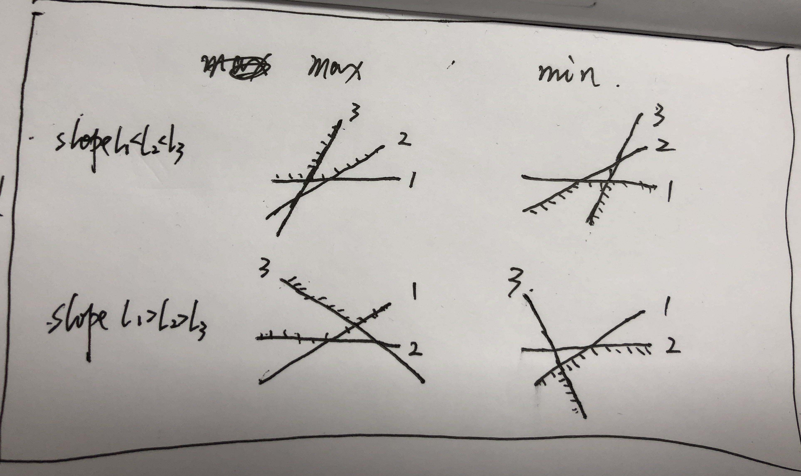

# Notes

## Dynamic Programing Basics
* When to use DP
	* Maximum/Minimum
	* Yes/No 
	* Solution count
	* Input can not be sorted/swapped (like sequence, string, but not set)
* When not to use DP
	* Find all solutions 
* DP implementation
	* Memorize search: cache solution of subproblems
	* Iteration: build up
		* State
		* Function
		* Initialization
		* Answer

## Tricks in DP
* Use state with size n+1
	* Starting point and Boundary: state[0][0], state[0][x], state[x][0]...
	* **Sometimes**, initialize state array with `length = problem scope + 1` to avoid boudary processing with `if-else`
	
	```java
	public boolean wordBreak(String s, List<String> wordDict) {
	    boolean[] isBreakable = new boolean[s.length() + 1];
	    //sentinel value for initial state
	    isBreakable[0] = true;
	    for(int i = 1; i <= s.length(); i++){
	    	...
	    }
	    ...
	    return isBreakable[s.length()];
	}
	```
* State rolling
	
	```java
	int[] dp = new int[n+1];
	dp[0] = 1;
	for...{
		int[] new_dp = new int[n+1];
		// Arrays.fill(new_dp, ...);
		// state transition
		// new_dp[i] = dp[i]...
		...
		dp = new_dp;
	}
	return dp[n];
	```
* Less state	dimension
	
## Matrix DP: Triangle, Unique paths
* Frequetly used dp states
	* dp[i][j]: state at grid s(i, j)
* Problems
	* [unique-paths-ii](https://leetcode.com/problems/unique-paths-ii)

## Sequence
* Sequence is ordered (unlike set)
* Frequetly used dp states
	* dp[i]: 
		* the solution including element at i 
		* or the subsequence [0, i]
	* dp[i][l]: subsequence of length l starting at i
* Problems
 	* [longest-palindromic-substring](https://leetcode.com/problems/longest-palindromic-substring): 
		* O(n^2) with DP: DP on all lengths substring 
		* O(n) with [Manacher's algo](https://www.felix021.com/blog/read.php?2040): max LPS length symetry around center
	* [word-break](https://leetcode.com/problems/word-break)
	* [climbing-stairs](https://leetcode.com/problems/climbing-stairs)
	* [palindrome-partitioning-ii](https://leetcode.com/problems/palindrome-partitioning-ii)
	* [longest-increasing-subsequence](https://leetcode.com/problems/longest-increasing-subsequence)

## 2-Sequence
* Frequetly used dp states
	* dp[i][j]: relationship between subsequence [0, i] in s1 and subsequence [0, j] in s2
	* dp[s1\_start][s1\_end][s2\_start][s1\_end]: relationship between subsequence in s1 and subsequence in s2
* Problems
	* Longest Common Subsequence: `f[i][j]`: length of the longest common subsequence till s1[i], s2[j]
	* Longest Common Substring: `f[i][j]`: length of the common substring ended with s1[i]=s2[j]
	* Min edit distance
	* [regular-expression-matching](https://leetcode.com/problems/regular-expression-matching)
	* [wildcard-matching](https://leetcode.com/problems/wildcard-matching/)
	

## Knapsack
* Backpack I: `f[i][j]`: the feasibility of any goods in first i goods whose volume can be added up to j.
* Backpack II: `f[i][j]`: the max price of any goods in first i goods whose volume can be added up to j.
* K-sum: `f[i][j][sum]`: the feasibility/solution # of j numbers in first i numbers that can be added up to 'sum'.

## Multiple States
* State Machine
	* best-time-to-buy-and-sell-stock-with-cooldown ([analysis](https://leetcode.com/problems/best-time-to-buy-and-sell-stock-with-cooldown/discuss/75928/Share-my-DP-solution-(By-State-Machine-Thinking))) 
		* state:
		
		```
		state machine: 
		* bought[i]: hold->bought[i+1]; sell->sold[i+1]. 
		* sold[i]: hold->cooldown[i+1]. 
		* cooldown[i]: hold->cooldown[i+1]; buy->bought[i+1]
		```
		
		* function
	
		```
bought[i] = max(bought[i - 1], cooldown[i - 1] - prices[i - 1]);
sold[i] = bought[i - 1] + prices[i - 1];
cooldown[i] = max(cooldown[i - 1], sold[i - 1]);
		```
	* best-time-to-buy-and-sell-stock-iv ([analysis](https://leetcode.com/problems/best-time-to-buy-and-sell-stock-iv/discuss/54150/State-machine-is-the-easiest-way-to-understand-stock-problem-could-solve-all-the-stock-problem-in-leetcode))
		* State: 
			* `Bought[i][j]`: max profit till day i - 1 with j - 1 transaction, and the last state is in 'Bought'; 
			* `Sold[i][j]`: max profit till day i - 1 with j - 1 transaction, and the last state is in 'Sold'
		
		```
		Bought[i][j] = max(Bought[i - 1][j], Sold[i - 1][j - 1] - price[i - 1])
		Sold[i][j] = max(Sold[i - 1][j], Bought[i - 1][j] + price[i - 1])
		```
* Problems
	* [best-time-to-buy-and-sell-stock-with-cooldown](https://leetcode.com/problems/best-time-to-buy-and-sell-stock-with-cooldown)
	* [best-time-to-buy-and-sell-stock-iv](https://leetcode.com/problems/best-time-to-buy-and-sell-stock-iv)
	* [best-time-to-buy-and-sell-stock-with-transaction-fee](https://leetcode.com/problems/best-time-to-buy-and-sell-stock-with-transaction-fee)
	* [maximum-product-subarray](https://leetcode.com/problems/maximum-product-subarray)


## Interval DP
* Given a interval/sequence, find optimal solution from partitions of all its sub intervals
* TC = O(n^3)
* dp[start][end]: solution for interval [start, end]
	* length i start from 2, ensure dp[k+1][j+i-1] exists

```
// iterate all intervals dp[start][start+len-1]: O(n^3)
long[][] dp = new long[n][n];
for (int i = 2; i <= n; i++) {
	for (int j = 0; j <= n - i; j++) {
		dp[j][j + i - 1] = Long.MAX_VALUE;
		for (int k = j; k < j + i - 1; k++) {
			dp[j][j + i - 1] = Math.min(dp[j][j + i - 1], dp[j][k] + dp[k + 1][j + i - 1]);
		}
	}
}
```
* problems:
	* [slime](https://atcoder.jp/contests/dp/tasks/dp_n)
	* [clear the string](https://codeforces.com/contest/1132/problem/F)

## Digit DP
* How many numbers between a and b satifying a particular property?
	* solve(a, b) = solve(0, b) - solve(0, a-1)
	* TC with number of n digits: O(n * state)
* dp[d][isLess][state] for solve(0, b): 
	* d: all numbers from MSB to digit d of b
	* isLess: 
		* 0: all digits before d are 'tight', so only 0~b[i] can be selected for digit i
		* 1: some digits before d are not 'tight', so all 0~9 can be selected for digit i
	* state: property
* template

```
//iterative
String s; //input
dp[0][0][0] = 1;
for(int d = 0; d < n; i++){
	for(int isLess=0; isLess < 2; isLess++){
		int max = (isLess == 1)? 9 : s.charAt(i) - '0';
		for(int k=0; k<=max; k++){
			isLessNext = (!isLess && (k==max))? 0 : 1;
			dp[d+1][isLessNext][state'] = dp[d][isLess][state] + ...;
		}
	}
}

```

```
//recursive
long solve(String s, int i, boolean isLess, state){
	if(i == s.length()){
		return ...;
	}
	
	int max = isLess ? 9 : s.charAt(i) - '0';
	long r = 0;
	for(int k=0; k<=max; k++){
		isLessNext = isLess || k < max;
		newState = f(state, i, k);
		r += solve(s, i+1, isLessNext, newState);
	}
	return dp[i][isLess][state] = r;
}
```
* Problems
	* [Digit Sum](https://atcoder.jp/contests/dp/tasks/dp_s)
* Reference: 
	* [桁DP入門](https://pekempey.hatenablog.com/entry/2015/12/09/000603)

## Recrusive DP
* When the boundary ('initial' or 'done' of DP) of the dp states are not explicit
* add cache for state
* Problems:
	* [Can I win](https://leetcode.com/problems/can-i-win/description/)
		*	a initial 'win' state is a state whose sum is less than target, and when adding any 1 of available number can make the sum above target. (Or we can define initial 'lose' as any state whose sum is over target)

## Bitmask DP for full permutation
* DP on a set/graph: bitmap for a subset of elements present
	* Characteristic: 
		* **Reduce n! permutation to 2<sup>n</sup> subsets**
		* n is small (usually n<20)
	* Find Hamiltonian path with small n (# of vertices)
		* brute force: check all permutations of vertices: O(n!)
		* bitmap DP: time O(2<sup>n</sup>n<sup>2</sup>), space O(2<sup>n</sup>n) 
			* bitmask for subset of vertices: 0~2<sup>n</sup>-1
			* dp[mask][i]: path through vertices in mask starts at 0 and ends at vertex i
			* transition: `dp[mask][i] = OR(dp[mask&~(1<<j)][j])` for each 1 bit j in mask, if there is an edge (j,i) in E
		* Reference: 
			* [A little bit of classics: dynamic programming over subsets and paths in graphs](https://codeforces.com/blog/entry/337)
			* Week 6 of 'How to Win Coding Competitions: Secrets of Champions'
	* [matching](https://atcoder.jp/contests/dp/tasks/dp_o): 
		* brute force: fix girls 1~n, check full permutations of boys: O(n!)
		* bitmap DP: time O(2<sup>n</sup>n), space O(2<sup>n</sup>)
			* bitmask: which boys are matched
			* dp[mask]: the # of ways when the first k girls are mathced with boys in bimask (k is the # of 1 bit in bitmask)
			* transition: `dp[mask] += dp[mask & (1<<j)]` for each 1 bit j in mask
	* [Little Pony and Harmony Chest](https://codeforces.com/contest/453/problem/B)
		* bitmask for prime factors subset
	* [Grouping](https://atcoder.jp/contests/dp/tasks/dp_u)
		* O(3<sup>n</sup>) DP for all subsets of subsets
		* For each subset of a set - a bitmask, check all subsets of it with 'Bitmask all subsets enumeration' trick
	* [SOS (Sum Over Subsets)](https://codeforces.com/blog/entry/45223): Also see SumOverSets.java
		* Sum over all subsets with bitmask: O(3<sup>n</sup>) -> O(2<sup>n</sup>*n)
		* Sum over all supersets can be processed as Sum over all subsets of complement

		~~~
		//sum over subsets
		int[] dp = new int[1 << n];
		for (int i = 0; i < subsets.length; i++) {
			dp[i] = subsets[i];
		}
		for (int i = 0; i < n; i++) {
			for (int j = 0; j < (1 << n); j++) {
				if ((j & (1 << i)) != 0) {
					dp[j] += dp[j ^ (1 << i)];
				}
			}
		}
		~~~
		
		~~~
		//sum over supersets
		int[] dp = new int[1 << n];
		for (int i = 0; i < subsets.length; i++) {
			dp[i] = subsets[i];
		}
		for (int i = 0; i < n; i++) {
			for (int j = 0; j < (1 << n); j++) {
				if ((j & (1 << i)) != 0) {
					dp[j ^ (1 << i)] += dp[j];
				}
			}
		}
		~~~
* DP on a matrix: bitmap for the rolling skyline (latest grid of each column)
	* A bitmask of m-bit for n * m matrix
		* skyline: represents the highest/latest grid of each column
		* rolling: for grid (i,j), the bitmask represents prev+cur line (i, 0), (i, 1), ..., (i-1,j), (i-1,j+1), ... (i-1, m) (or cur+next line (i+1, 0), (i+1, 1), ..., (i,j), (i,j+1), ... (i, m))
		* dp state relation: for grid (i, j), it may only corelates to the points next to it
	* 铺砖问题(《挑战程序设计竞赛》p193)
	* [Floorboard](https://community.topcoder.com/stat?c=problem_statement&pm=8397)
		* bitmap for vertical board state
		* DP by recursion and memoization can be used
* Reference
	* [A little bit of classics: dynamic programming over subsets and paths in graphs](https://codeforces.com/blog/entry/337)
	* [Algorithms live - Bitmask Dynamic Programming](http://algorithms-live.blogspot.com/2017/05/episode-20-bitmask-dynamic-programming.html) 
	* [[Tutorial] Non-trivial DP Tricks and Techniques](https://codeforces.com/blog/entry/47764)
	* 《挑战程序设计竞赛》p193


## Fast Matrix Power DP
* O(logn)
* Problems:
	* [Walk](https://atcoder.jp/contests/dp/tasks/dp_r)

## Tree DP
* Problems
	* [Independent Set](https://atcoder.jp/contests/dp/tasks/dp_p)
	* [SubTree](https://atcoder.jp/contests/dp/tasks/dp_v)

## DP with Inclussion-exclusion 
* dp[i]: bad solutions starting at point i excluding i-1 former bad points
* transition: dp[i] = dist(1, i) + dp[j]*dist(j, i)
* [(Grid 2)](https://atcoder.jp/contests/dp/tasks/dp_y)
	* Avoid 'bad' blocks : paths from (1, 1) to (n, m) without touching any of the k bad blocks (r<sub>1</sub>, c<sub>1</sub>), (r<sub>2</sub>, c<sub>2</sub>)...(r<sub>k</sub>, c<sub>k</sub>), and **the bad blocks are ordered by r, c**
		1. dp(r<sub>1</sub>, c<sub>1</sub>) = L((1, 1), (r<sub>1</sub>, c<sub>1</sub>))
		2. dp(r<sub>i</sub>, c<sub>i</sub>) = L((1, 1), (r<sub>i</sub>, c<sub>i</sub>)) - sum(dp(r<sub>j</sub>, c<sub>j</sub>) * L((r<sub>j</sub>, c<sub>j</sub>), (r<sub>i</sub>, c<sub>i</sub>))) where j in [1, i-1] and block (r<sub>j</sub>, c<sub>j</sub>) is within the range of [(1, 1), (r<sub>i</sub>, c<sub>i</sub>)]
			* dp(r<sub>j</sub>, c<sub>j</sub>) * L((r<sub>j</sub>, c<sub>j</sub>), (r<sub>i</sub>, c<sub>i</sub>)): bad paths from (1,1) to (r<sub>i</sub>, c<sub>i</sub>) with the first bad block (r<sub>j</sub>, c<sub>j</sub>)
* Good Sequence
	* See 'GoodSequence' in dp code
* reference: [Change the object to dp](https://codeforces.com/blog/entry/47764)

## Open close interval trick
* Ideas 
	* Counting # of different ways to partition a set into subsets with some constraint. **The problem usually constrains the state of subset as a whole, instead of each pair-wise element state in a subset**
	* Usually in the problem, we only cares about, for each element in the set, how many subsets in different partition that covers it.
	* dp state: 
		* firstly order the elements
		* dp[i][k][l]: the ith element with k opening sets/intervals at some restriction l (such as count restriction)
		* transition:
			1. open new interval: dp[i+1][k+1][l'] += dp[i][k][l]
			2. close interval: dp[i+1][k-1][l'] += dp[i][k][l]
			3. open & close interval: dp[i+1][k][l'] += dp[i][k][l]
	* prerequisite: max # of subsets (k) is small
* Problems
	* [626F - Group Projects](https://codeforces.com/contest/626/problem/F)
	* [466D - Increase Sequence](https://codeforces.com/contest/466/problem/D)
	* [367E - Sereja and Intervals](https://codeforces.com/contest/367/problem/E)
* Reference
	* [[Tutorial] Non-trivial DP Tricks and Techniques](https://codeforces.com/blog/entry/47764)


## Exchange Argument Trick
* Unordered -> ordered: given a set which has no order among elements, we want sort it into some order, so that we can sequence DP on it. (check each element from left to right, and the current solution for current element will not affect former solutions).
* Reference
	* [Exchange Arguments](https://codeforces.com/blog/entry/63533)
* Problems
	* [Tower](https://atcoder.jp/contests/dp/tasks/dp_x)

## DP Optimization: Prefix Sum
* O(nk^2) -> O(nk)
* How many ways to add up n numbers to k, the value of each number i is in range of [0, a[i]]
	* dp[i][j]: ways of first i numbers add up to j
	* `dp[i][j] = sum(dp[i - 1][j - x]) where 0 <= x <= min(j, a[i])`
* Optimization:
	* Introduce prefixSum[i][j] = sum(dp[i][x]) where 0 <= x <= j

	~~~
	//initialize case 0, becasue j can be 0
	for (int i = 0; i <= n; i++) {
		dp[i][0] = 1;
		pSum[i][0] = 1;
	}
	for (int i = 0; i <= k; i++) {
		pSum[0][i] = 1;
	}
	
	dp[i][j] = prefixSum[i - 1][j] 
						- (j >= a[i] + 1) ? prefixSum[i - 1][j - a[i] - 1] : 0 
	prefixSum[i][j] = prefixSum[i][j - 1] + dp[i][j]
	~~~
* Problems:
	* [Candies](https://atcoder.jp/contests/dp/tasks/dp_m)

## DP Optimization: Segment tree
* O(n^2) -> O(nlogn)
* h[i], v[i] are 2 properties of the ith item (i.e. height and value in problem 'flower')
	* dp[i] = max(dp[j]) + v[i] where j<i and h[j]<h[i]
* Optimization: use segment tree for range query
	* dp[i] = max(0, h[i]) + v[i]
	* update(h[i], dp[i])
* Problem
	* [Flowers](https://atcoder.jp/contests/dp/tasks/dp_q)
	* [Intervals](https://atcoder.jp/contests/dp/tasks/dp_w)

## DP Optimization: Convex Hull Trick
* O(n^2) -> O(nlogn) or O(n)
* When dp[i] is obtained by iterate all its previous dp states
	* dp[i] = max(k(j) * a[i] + b(j) + dp[j]) where j < i and j~i satisfies a limit function limit(j...i) > 0
* Intuition
	* It can be seen as find the optimal value for input a[i] among a set of lines
		* What's a line
			* dp[i] = max(k(j) * a[i] + b(j) + dp[j]) where 0 < j < i
				* denote f(x) = k(j) * x + b(j) + dp[j]. Then f(x) is a line, x is variable whose value is in {a[1], ...a[n]}, k(j) is slope, b(j) + dp[j] is intercept
				
				~~~
				i.e. 
				1. 
				dp[i] = max(dp[j]+(j-i)^2) where 0<j<i
				dp[i] = max(-2j*i+j^2+dp[j])+i^2
				A line is with slope -2j, intercept j^2+dp[j]
				2.
				dp[i] = max(dp[j]+(a[j]+...+a[i])*a[i])
				we introduce prefixSum S
				dp[i] = max(-S[j]*a[i]+dp[j])+S[i]*a[i]
				A line is with slope -S[j], intercept dp[j]
				~~~
	* For a line, it can only answer a section of optimal values which are part of this line. All answers of optimal values are on the convex hull of the set of lines
	* Find a data structure CHT (deque/BST)to maitain the convex hull
		* adding a line [k(i), b(i) + dp[i]] as [k, b] to CHT after dp[i] is calculated 
		* query for max(k * a[i] + b) by binary search in CHT for the proper line
* Implementation details:
	* When to delete a line? 
		1. Not part of convex hull any more 
			* assume the slope of l1, l2, l3 are in order, and l3 is a new line, interX(l1,l2) means the x of intersection between l1, l2. The table below lists all the conditions when l2 should be removed because l3 is a better choice than l2 (l2 is not part of convex hull any more after l3 is added).
			

				| slope order   | max   | min |
				| ----  | ----  |---- |
				| ascending (l1<l2<l3)  | `interX(l1, l2) >= interX(l1, l3)` <br>`interX(l1, l2) >= interX(l2, l3)` <br><code>**(b1-b2)\*(k3-k2)>=(b2-b3)\*(k2-k1)**</code>|`interX(l1, l2) <= interX(l1, l3)` <br> `interX(l1, l2) <= interX(l2, l3)`<br><code>**(b1-b2)\*(k3-k2)<=(b2-b3)\*(k2-k1)**</code>|
				| descending (l1>l2>l3)  | `interX(l1, l2) <= interX(l1, l3)` <br> `interX(l1, l2) <= interX(l2, l3)`<br><code>**(b1-b2)\*(k3-k2)<=(b2-b3)\*(k2-k1)**</code>|`interX(l1, l2) >= interX(l1, l3)` <br> `interX(l1, l2) >= interX(l2, l3)`<br><code>**(b1-b2)\*(k3-k2)>=(b2-b3)\*(k2-k1)**</code>|
				
				**Note use the formula in bold above for checking because it takes the 'parallel lines' problem into consideration**
				
		2. Out of query range
			* a line j is out of query range for breaking the limit function limit(j, i)<0
	* O(n) or O(nlogn)
		* Order matters
			1. slope order: whether the slope of lines are in order during insertion
			2. query order: whether the variable x are in order during query `for x find max/min of kx+b for all [k,b]`
		* O(n) when both are ordered
			* For 'max' problem, the convex hull is in shape '∪', the slope increases as the x varaible increases; while for 'min' problem, the convex hull is in shape '∩', the slope decreases as the x varaible increases
			* When slope is ordered we can do 'Not part of convex hull any more' deletion on new line insertion from just one end of the queue; when query is ordered, we can do 'Out of query range' deletion during query from just one end of the queue (this can be the same or opposite end of 'Not part of convex hull any more' deletion)

				| order   | max   | min |
				| ----  | ----  |---- |
				| slope order = query order  | deque |stack |
				| slope order = - query order  | stack |deque |

		* O(nlogn) when at most 1 ordered: monotonic queue optimization
			* When slope unordered, we must use BST to find and insert new line, and we must do 'Not part of convex hull any more' deletion for two directons (towards high, towards low)
			* When query unordered, we must keep all inserted lines and use binary search to find the best answer
			* When both are unordered, this is called `dynamic convex hull trick`, we use BST
	* Classical problems:
		* Multiple knapsack optimization in O(nV) (n - item count, V - volume of backpack)
		* [K-Anonymous Sequence](http://poj.org/problem?id=3709): (《挑战程序设计竞赛》p342): be careful of parallel lines
		* [filling-bookcase-shelves optimization](#filling-bookcase-shelves-optimization)
* Reference
	* [[Tutorial] Convex Hull Trick — Geometry being useful](https://codeforces.com/blog/entry/63823): 
		* CHT formula explained by geometry based method
	* [Convex hull trick and Li Chao tree](https://cp-algorithms.com/geometry/convex_hull_trick.html)
	* [CONVEX HULL TRICK](https://jeffreyxiao.me/blog/convex-hull-trick): CHT formula explained by elements comparison 
	* [Dynamic Programming Optimizations](https://codeforces.com/blog/entry/8219)
	* [Algorithm lives](https://algorithms-live.blogspot.com/2017/03/episode-11-convex-hull-optimization.html): 
		* demonstrate one problem with dequeue in O(n) and one problem with dynamic CHT in O(nlogn)
		* obsolete removal check by 'time overtaken'
	* 《挑战程序设计竞赛》p342

## Miscellaneous
* [Permutation](https://atcoder.jp/contests/dp/tasks/dp_t) 
	* dp[l][i] is all valid permutations of lenth l end with number i
		* dp[l][i] = sum(dp[l - 1][j]) for each j <= i, when ">"
		* dp[l][i] = sum(dp[l - 1][j]) for each j > i, when "<"
* [filling-bookcase-shelves](https://leetcode.com/problems/filling-bookcase-shelves)
	* O(n^2): dp[i] is min height of books from 1 to i
		* dp[i] = min(max(h[j],...,h[i])+dp[j-1], dp[i]) for all j that book j to book i can be put in one shelf layer
	 	* <a name='filling-bookcase-shelves-optimization'></a>[filling-bookcase-shelves optimization](https://leetcode.com/problems/filling-bookcase-shelves/discuss/323518/This-problem-is-simplified-from-USACO-12'-Bookshelf-which-has-O(NlogN)-solution): O(nlogn)
		 	* [editorial](http://www.usaco.org/current/data/sol_bookshelf_gold.html)
		 	* Use deque to maintain intervals for different hmax [a0, a1], [a1+1, a2], [a2+1, a3], ..., [an+1, i], s.t., height[a1] > height[a2] > ... > height[i]
		 	* Use BST to maintain partial answer: dp[x-1]+hmax(x, i), we only need to add partial answer in case x is start of interval
* [Partition a set into 2 subsets and minimize the difference of subsets sum](https://www.geeksforgeeks.org/partition-a-set-into-two-subsets-such-that-the-difference-of-subset-sums-is-minimum/)
	* Suppose `n` is size of set, `S` is the sum of all numbers.
	* Use 0-1 knapsack to find all the possible sum of subsets: `boolean dp[i][sum]`
	* find a subset sum which is closest to `floor(S/2)` (or `ceiling(S/2)`)
	* TC: O(nS)

## Reference
* [Dynamic Programming Type](https://codeforces.com/blog/entry/325)