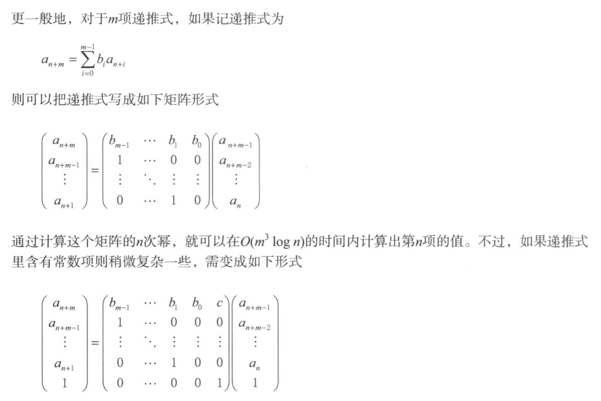
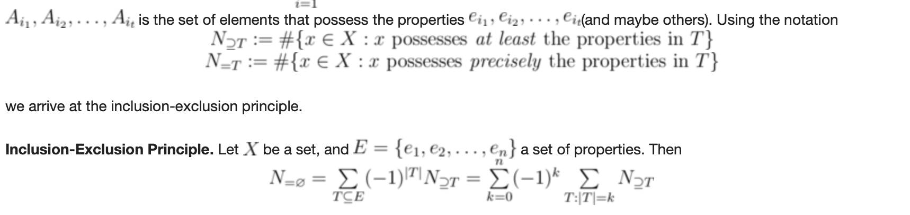
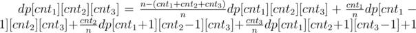

# Notes

## Matrix
* Multiplicaton
	* Strassen's algorithm: `O(n^log7)`
		*  Triple loop has TC in `O(n^3)`
		*  Reduce submatrix multiplication from 8 to 7 by transform multiplication into addition/substraction
		*  Space consuming
		*  In spite of asymptotically fast, Strassen's algorithm is slow in real world for large constant factor
* LUP Decomposition: `O(n^3)`
	* Solve linear equation Ax=b, where **A is full rank square matrix** (X has and only has 1 fessible solution) with following steps
		1. LUP decomposition: `O(n^3)`
			* `PA = LU`
				* P is permutation matrix: choose pivot which guarantee U[i][i]!=0
				* L is a **unit** lower triangle matrix
				* U is a upper triangle matrix
			* Gaussian elimination
		2. Solve equation when A is LUP decoposed: `O(n^2)`
			1. Solve y from `Ly = Pb` by forword substitution
			2. Solve x from `Ux = y` by backward substitution
* Matrix inversion: `O(n^3)`
	* Matrix inversion <=> solve equation `AX = I`
		* LUP decomposition for solving each `Ax=e_i` of I
* Problems can be solved by quick matrix power(Fibnacci number)
	* from 《挑战程序设计竞赛》p198

## Linear Programming
* Standard form: used for define problem
	
	
	~~~
	Maximize: sum(c[j] * x[j]), where j = 1 ~ n
	Subject to: 
	(i) sum_i(a[i, j] * x[j]) <= b[i] where i = 1 ~ m, j = 1 ~ n
	(ii) x[j] >= 0 where j = 1 ~ n
	~~~

	* maximize objective, '<=' ineuality constraint, varaibles non-negative constraint
	* transform to standard form
		* minimize objective: maximize negation objective
		* equality constraint: `=` <=> `>= and <=`
		* `>=` inequality constraint: negation for `<=`
		* variables x[i] not non-negative: introduce 2 non-negative aux variables for `xl`, `xr`, and define `x[i] = xl - xr`
* Slack form: used for Simplex method

	~~~
	Maximize: sum(c[j] * x[j]), where j = 1 ~ n
	let x[n+i] = b[i] - sum_i(a[i, j] * x[j]) where i = 1 ~ m, j = 1 ~ n
	Subject to: x[j] >= 0 where j = 1 ~ n + m
	
	~~~
	
	* slack variables(`x[n+i]`), basic variables (variables on the left of equation) and non-basic variables (variables on the right of equation)
* Possible solutions of a LP problem
	* no feasible solution satifies all constraints
	* has 1 optimal solution
	* unbounded: objective can be positive infinite
* Simplex method
	* Intuitive: 
		* The constraints defines a **simplex** which is a **convex** region in solution space, and the optimal objective value must be obtained on one vertex of the region.
		* Simplex method first check objective value on 1 vertex and moves along the edge to its neighbor vertex whose objective value is non-decreasing
		* Simplex terminates at a local optima when all neighbors have smaller objective value
	* Change non-basic variables to basic variables by transformation among euqavalent slack forms until all the coefficients in objective are non-positive
	* pivot: roll in new basic variable and roll out old basic variable
	* initialize-simplex: 
		* check if feasible by solving a auxiliary LP problem
		* find a initial feasible solution where to start from 
* Duality in LP problem
	* Primal problem: `maximize cx where Ax <= b, x >= 0`
	* Dual problem: `minimize by where transpose(A)y >= c, y>=0`
	* LP duality: `cx* = by*` where `x*` and `y*` are solutions when the primal and dual problems get their optimal value

## Polynomials and FFT
* Polynomials
	* 2 representions of a polynomial P(x)
		* coefficient: a vector of n coefficients (a0, a1, ..., an-1) in which ai is for xi
			* addition: O(n), multiplication: O(n^2)
		* point-value: a set of n point-value pairs ((x0, y0), (x1, y1), ..., (xn-1, yn-1)) in which y0=P(x0)
			* addition: O(n), multiplication: O(n)
		* point-value form to coefficient form: Uniqueness of interpolation
			* The n point-value pairs uniquely determines a coefficient form of a polynomial with order not more than n.
	* Multiplication and Convolution
		* polynomial's multiplication = polynomial's convolution

		~~~
		multiplication: M = A * B
			
		      a1    a0
		x     b1    b0
		-----------------------
		      a1*b0 a0*b0
		a1*b1 a0*b1
		-----------------------
		M(2)  M(1)  M(0)
		~~~
				
		~~~
		C = convolution(A, B)
		C(0)
		      a1    a0
		<-          b0    b1
		------------------------
		            a0*b0
		            
		C(1)
		      a1    a0
		<-    b0    b1
		------------------------
		      a1*b0 a0*b1
		                  
		C(2)
		      a1    a0
		b0    b1
		------------------------
		      a1*b1
		~~~

	* multiplication design: O(nlogn)
		1. Double degree-bound: Create coefficient representations of A(x) and B(x) as degree-bound 2n polynomials by adding n high-order zero coefficients to each.
		2. Evaluate: Compute point-value representations of A(x) and B(x) of length 2n by applying the FFT of order 2n on each polynomial. These representations contain the values of the two polynomials at the (2n)th roots of unity.
		3. Pointwise multiply: Compute a point-value representation for the polynomial C(x)=A(x)B(x) by multiplying these values together pointwise. This representation contains the value of C(x) at each (2n)th root of unity.
		4. Interpolate: Create the coefficient representation of the polynomial C(x) by applying the FFT on 2n point-value pairs to compute the inverse DFT.
* DFT
	* Point value pair form with DFT
		* y = DFTn(a): For polynomial Pa with coefficients a = (a0, a1, ..., an-1), DFT is used to calculate values y = (y0, y1, ..., yn-1) of point-value pairs ((w0, y0), (w1, y1), ..., (wn-1, yn-1)) in which w = (w0, w1, ..., wn-1) are the complex nth roots of unity
	* Convolution theorem: Fourier transform of a convolution is the pointwise product of Fourier transforms
		* AB <=> IDFT2n(pairwise-product(DFT2n(a), DFT2n(b)))
* FFT: compute DFTn(a) in O(nlogn)
	* AB <=> IFFT2n(pairwise-product(FFT2n(a), FFT2n(b)))
	* Recusive FFT
		* FFTn(a) = FFTn/2(a\_even) + wFFTn/2(a\_odd), because
			* An(wn) = A\_evenn/2(wn2) + wnA\_oddn/2(wn2) = An/2\_even(wn/2) + wn*An\_odd(wn/2)
			* wn2 = wn/2
	* IFFT: FFT2n-1(y) is a modified FFT with 
		* switch roles of a and y
		* wn -> wn-1
		* devide the FFT result by n

## Number Theory
* GCD
	* Extended Euclid recursive GCD: solve ax + by = d where d = GCD(a, b)
* Modular arithmetic
	* Groups: (S, ⊕)
		1. Closure: For all a, b in S, a ⊕ b ∈ S
		2. Associativity: For all a, b, c ∈ S, (a ⊕ b) ⊕ c = a ⊕ (b ⊕ c).
		3. Identity: There exists an **unique** identity element e in S such that, for every element a in S, the equation e ⊕ a = a ⊕ e = a holds.
		4. Inverse: For each a in S, there exists an element b in S, commonly denoted a−1, such that a ⊕ b = b ⊕ a = e, where e is the identity element.
	* Groups: Assume ℤn={0,1,...,n-1}
		* abelian group (cummutative group): b ⊕ a = a ⊕ b
		* finite group: |S| is a finite number
		* finite abelian group: 
			* Additive group modulo n as (ℤn, +n) is finite abelian group with identity 0
			* Multiplicative group modulo n as (ℤ\*n, •n), in which ℤ*n = {a: a ∈ ℤn, a is relative prime to n}, is finite abelian group with identity 1
				* **'Relative prime' guaratees the existense of inverse**: i.e. ℤ\*15={1,2,4,7,8,11,13,14}
				* |ℤ*n| = φ(n): i.e. |ℤ\*15| = 15(1-1/3)(1-1/5) = 8
	* Euler's totient (phi) function: how many integers are there in ℤn that are relatively prime to n
		* if n = p1r1.p2r2...pmrm, in which p are primes, then the Euler's totient function is φ(n) = n(1-1/p1)(1-1/p2)...(1-1/pm)
			* if n = pr which p is prime, then φ(n) = pr-pr-1
			* φ(n)= φ(p1r1).φ(p2r2)...φ(pmrm)
		* The size of multiplicative group modulo n: |ℤ*n| = φ(n)
	* Subgroups
		* Lagrange's theorem: If (S, ⊕) is a finite group and (S', ⊕) is a subgroup of |S|, then |S'| is a divisor of |S|.
			* Corrolary: if S' ⊂ S, then |S'| <= |S|/2
		* generator
			* generator 'a' generates subgroup **⟨a⟩** by repeatedly apply operation ⊕ to itself: ⟨a⟩ = {a(k): k >= 1}
				* For (ℤn, +n), a(k) = ka mod n
				* For ℤ*7, ⟨2⟩ = {1,2,4}, ⟨3⟩ = {1,2,3,4,5,6}
		* The order of a generator ord(a): smallest number t that a(t) = e
			* i.e., For ℤ*7, ord(2) = 3, ord(3) = 6
			* Properties of generator's order
				1. ord(a) = |⟨a⟩|	
				2. a(i) = a(j) if and only if i ≡ j (mod ord(a))
				3. a(|S|) = e, for |⟨a⟩| is a divisor of |S|
	* Solving modular linear equation: ax ≡ b (mod n)
		* For (ℤn, +n), if d = gcd(a, n), then
			* The subgroup generated by a is the same as subgroup generated by d: ⟨a⟩ = ⟨d⟩ = ⟨d, 2d, ...(n/d-1)d⟩
			* The size of subgroup generated by a is |⟨a⟩| = n/d
		* Solution of ax ≡ b (mod n)
			* Solvability: For (ℤn, +n), solvable <=> b in subgroup of ⟨a⟩ <=> b in subgroup of ⟨d⟩ <=> d|b
			* \# of solutions
				* if d|b, then d
				* if d is relative prime to b, then 0
			* solutions
				* initial solution
					* x0 = x'(b/d) mod n, where x' is from extended Euclid GCD ax'+ny'=d
				* all solutions
					* xi = x0 + i(n/d) mod n, where x0 is the initial solution
			* Corrolaries
				* if a is prime to n, then there is only 1 solution
				* if b = 1, then ax ≡ 1 (mod n) is finding **mulplicative inverse** a-1
					* a has a multiplicative inverse a-1 if and only if a is prime to n
	* Solving linear equation group: {x ≡ ri (mod ni)}
		* Chinese remainder theorem
			* n=n1n2...nk, where ni are **pairwise relatively prime**, under (ℤn, +n), x and (r1, r2, ..., rk) has 1-1 corespondence
				* x -> (r1, r2, ..., rk): ri = x mod ni
				* (r0, r1, ..., rk) -> x: solution to linear equation group
					* let **n-i** = n1n2...ni-1ni+1...nk, **ci** = n-i(n-i-1 mod ni), so that ci mod ni = 1 and ci mod nj = 0
					* x ≡ (c1r1 + c2r2 + ... + ckrk) (mod n)
			* Note
				* Chinese reminder theorem doesn't require each ni to be prime, it just requires **pairwise relatively prime**, i.e. 3,4,5 are pairwise relatively prime although 4 is mot a prime.
				* Chinese reminder theorem guarantees thre is a unique solution x in [0, n], and x+kn are all solutions.
			* Corrolary
				* if n=n1n2...nk, where ni are **pairwise relatively prime**, then x ≡ r (mod ni) <=> x ≡ r (mod n). This can be usedful when convert a non-pairwise relative prime problem to a pairwise relative prime problem
					* For equation {x ≡ 2 mod 6, x ≡ 2 mod 15, x ≡ 5 mod 7}, it's equavalent to {x ≡ 2 mod 2, x ≡ 2 mod 3, x ≡ 2 mod 3, x ≡ 2 mod 5, x ≡ 5 mod 7},  so the reduced form is {x ≡ 0 mod 2, x ≡ 2 mod 3, x ≡ 2 mod 5, x ≡ 5 mod 7}
			* Implementation
				* In addition to the math solution for the problem, 'sieving' can be used for finding solution
	* Power
		* Theorem with property of generator's order: a(|S|) = e
			* Euler's theorem: aφ(n) ≡ 1 (mod n) for all a ∈ ℤn*
			* Fermat's theorem: if p is prime, ap-1 ≡ 1 (mod p) for all a ∈ ℤp*
		* Compositivity: if there exists a **nontrivial square root of 1, modulo n**, then n is composite.
			* Nontrivial square root of 1, modulo n: if the equation x2 􏰌≡ 1 mod n has solution other than the two “trivial” square roots: 1 or 􏰐-1, modulo n
		* Modular exponentiation by repeated squaring
			* ab mod n = (ab/2 mod n)2 mod n when n%2=0; a*(ab-1 mod n) mod n when n%2=1
	* Primality testing
		* Simple prime test for n: O(sqrt(n))
			* n is composite if n can devide 2 ~ sqrt(n)
		* Sieve of Eratosthenes: O(nloglogn)
			* for all primes less than n: for primes i in range [2, sqrt(n)], all multiples of i are composite.
			* for all primes between [a, b]:
				1. simple sieve for small primes less than sqrt(b)
				2. sieve for all primes in [a, b] with small primes
		* The density of prime numbers
			* 􏰄prime number theory: limn->∞(􏰄π(n)/nlnn) = 1, where 􏰄π(n) is number of primes less or equal to n
			* Pick 1 number n and the probability of prime is 1/lnn 
		* Fermat theorem for pseudo-prime testing: 
			* if an-1 ≡ 1 (mod n), n could be 
				* a prime
				* or a base-a pseudo-prime (composite)
			* basic idea: 
				1. choose base a = 2
				2. check n if 2n-1 mod n = 1:
					* if false, composite
					* if true, possibly prime, change another base for test
			* Why this doesn't work
				* Carmichael numbers: there exists composites that satisfy the fermat equation under all base a, such as 561, 1105, and 1729
		* Miller-Rabin randomized primality test: 
			* improvement based on pseudo-prime testing
				* It tries several randomly chosen base values a instead of just one base value.
				* While computing each modular exponentiation, it looks for a **nontrivial square root of 1, modulo n**, during the final set of squarings. If it finds one, it stops and returns COMPOSITE.
			* Error probability
				* For Miller-Rabin(n, s) where s is the trial times, the err is at most 1/2s
			* Complexity for Miller-Rabin(n, s): O(slog3n)
	* RSA crptosystem
		* Assumption
			* RSA based on the fact that **factorization of a large number n is hard**: no polynomial time algorithm
				* when factors of n can be found, then the private key can be calculated easily
		* Public key P and Secret key S
			* Asymetric crptographic: For message M, M = S(P(M)) = P(S(M))
		* Procedure
			* Key generation
				1. find 2 large primes p and q (i.e., 1024 bit each)
				2. n = p * q
				3. find small odd number e relatively prime to φ(n) (Euler's totient function)
				4. Compute d as the multiplicative inverse of e, modulo 􏰅φ(n)
				5. publish public key (e, n)
				6. keep secret key (d, n)
			* Encryption and Decryption
				1. For plain message M, encrypt M as P(M) = Me mod n
				2. For encrypted message M' = P(M), decrypt M' as S(M') = (M')d mod n = M
		* Intuitives
			* Group theory , inverse, and modular arithmatic can be foudation of RSA
			* The cryptosystem should be able to hold the property Med ≡ M (mod n). To solve the equation, we know from the Euler's (power) theorem Mφ(n) ≡ 1 (mod n), so ed = kφ(n) + 1 => ed ≡ 1 (mod φ(n)) => e and d are multiplicative inverse modulo φ(n) of each other
	* Factorization of integer
		* Pollard-rho heuristic: find a factor in O(n1/4)
			* Based on Floyd's tortoise and hare algorithm: 
				* Create a cycle: xi = xi-12-c mod n
				* Find 2 number meet in the cycle: xi ≡ xj mod p, where p is a factor of n, so that gcd(x<ub>i - xj, n) = p
		
## Computational Geometry
* Segment
	* Vector's product: p1(x1,y1), p2(x2,y2)
		* dot product: p1 . p2 = x1x2 + y1y2
			* vector cosine similarity
			* p1 . p2 = |p1||p2|cos\<p1, p2>
		* cross product: p1 * p2 = x1y2 - x2y1
			* Area of parrelelogram with direction: |p1 * p2| = |p1||p2|sin\<p1, p2>
			* Sign: + means counter-clockwise, - means clockwise
		* rotate: counter-clockwise by θ
			* x' = xcosθ - ysinθ, y' = xsinθ + ycosθ
	* 2 segments intersection
		* 2 segments intersects if
			1. Each segment straddles the line containing the other, or
			2. An endpoint of one segment lies on the other segment.
	* Any segments intersection: determining whether any two line segments in a set of segments intersect
		* Sweep line (Shamos-Hoey algorithm): O(nlogn)
			* Sweep from left to right while keeping a total order of active segements, only the adjacent segments could have chance to intersect
				* sweep line status: ordering of active segments that the sweep line intersects
				* event point schedule: where sweep line stops to add new segment or to remove inactive segment
* Rectangle
	* representation: [left, bottom, right, top]
	* intersection(a, b): [Math.max(a.left, b.left), Math.max(a.bottom, b.bottom), Math.min(a.right, b.right), Math.min(a.top, b.top)]
	* union area: inclusion-exclusion principle with bitmask
	* Check if a ractangle is overlap with circle:
		* find the closest point in rectangle to the center of circle, check if it's in the circle: 

		~~~
		double x = (x_center <= left) ? left : (x_center >= right) ? right : x_center;
		double y = (y_center <= bottom) ? bottom : (y_center >= top) ? top : y_center;
		~~~
* Convex Hull: CH(Q)
	* Graham's scan algorithm: O(nlogn)
		1. Choose initial point p0 who has the lowest y, it must be the point of CH
		2. Sort other points by the polar angle of p0pi in couter-clockwise order, and the choose the point with max |p0pi| if multiple points have the same polar angle. 
		3. For the sorted points (p0,...,pk ), maintain a stack S for points, for each point pi
			* push point pi if  angle of Stop-1Stop, Stoppi is counter-clockwise
			* pop Stop if  angle of Stop-1Stop, Stoppi is clockwise
	* Javis's march algorithm: O(nh) where h is the number of vertices of convex hull
		1. Choose initial point p0 who has the lowest y, it must be the point of CH
		2. For p0, pick the point pi which p0pi has the lowest polar angle, and for pi, pick the point pi which pipi+1 has the lowest polar angle...
* Closest pair of points: O(nlogn)
	* Devide and Concur
		1. Split the points set into 2 by splitter x=a, recursively get minimum distance from each part, and d = min(dl, dr).
		2. Check if points between 2 parts has shorter distance. for each point in region (a-d, a+d) with y sorted, only check the points not d higher above it. It can be proven that at most 7 points have to be checked. 
* Angular sweep `O(n^2logn)`
	* [maximum-number-of-darts-inside-of-a-circular-dartboard](https://leetcode.com/problems/maximum-number-of-darts-inside-of-a-circular-dartboard)
		* for each point, place it on the circle boundary. Then sweep (or "rotate") the circle around this point to see which direction contains the most points
			* for each other point, record the legal angles ranges [enter, exit] that the point is within the circle
			* we have 2 list of intervals, let's find the max number of intervals overlapping. which can be done in O(nlogn) with sort
	* reference: [geeksforgeeks](https://www.geeksforgeeks.org/angular-sweep-maximum-points-can-enclosed-circle-given-radius/)
	* problem: 

## Number theory II

* The # of factor p in n! (the largest k which makes p^k devides n!)
	*  f(n, p) = ⌊n/p⌋ + ⌊n/(p^2)⌋ +...
	* [Trailing zeros of n!] (https://leetcode.com/problems/factorial-trailing-zeroes): how many 5s in n!

*  Lattice point (x, y are both integer) on a line (from (a, b) to (c, d))
	*  gcd(c-a, d-b) + 1
	*  [Reference explaination](https://math.stackexchange.com/questions/628117/how-to-count-lattice-points-on-a-line): consider the representation of y in term of x
*  Modular multiplicative inverse of x modulo p
	*  p is prime
		*  [Fermat's theory](#Fermat), Fast modular exponentiation: inverse(x) = x(p-2) mod p
	*  p is not prime
		*  [Euler's theorem](#Euler): inverse(x, p) = x(φ(p-1) mod p

*  Quick Inverse fact (x!)-1 mod p
  	*  Quick modular multiplicative inverse modulo p for all [1..x] 
		*  DP in O(n) ([ref1](https://www.quora.com/How-do-I-find-the-value-of-nCr-1000000007-for-the-large-number-n-n-10-6-in-C), [ref2](https://www.geeksforgeeks.org/modular-multiplicative-inverse-1-n)): inverse(x, p) = (inverse(p%x)(x-p/x))%x
	*  inverseFact(x) = (inverseFact(x-1) * inverse(x,p)) % p
*  Quick nCr % p with large p ([ref](https://www.geeksforgeeks.org/queries-of-ncrp-in-o1-time-complexity/)): 
	*  nCr % p = (Fact(n) * inverseFact(n-r) * inverseFact(r))%p
* Find the best fraction between 2 fractions
	* Continued Fraction
		* 2 Representations: 
			* short form: 3.14155 = [3; 7, 15, 2, 7, 1, 4, 2]
			* long form: 3.14155 = [3; 7, 15, 2, 7, 1, 4, 1, 1]
	* Stern-Brocot Tree
		* start from [0/1, 1/0], constantly insert mediant of (p1, q1), (p2, q2) which is (p1+p2)/(q1+q2)
		* all irreducable fractions are in the tree
	* Find the best fraction between 2 fractions F1, F2
		* best: This fraction will be best in the sense that no other fration in (F1, F2) will have a smaller numerator or a smaller denominator.
		* F = LCA(F1, F2) of Stern-Brocot Tree, except when F1 (or F2) is the LCA, then F wil be one of the direct child of the F1 (or F2) who shares the path with F2 (or F1)
		* algorithm: [ref](https://en.wikipedia.org/wiki/Continued_fraction#Best_rational_within_an_interval)
			* for the 4 pairs of continued fraction representations of F1, F2: (short, long) x (short, long), find the sequence with the algorithm below
				* if x = [a0, a1, a2, …, ak-1, ak, ak+1, …], 
y = [a0, a1, a2, …, ak-1, bk, bk+1, …], then a best fraction candidate is  [a0, a1, a2, …, ak-1, min(ak, bk) + 1]
				* the 1st candidate F' that satified the F1< F' <F2 is the best fraction F
		* Reference: 
			* [wiki](https://en.wikipedia.org/wiki/Continued_fraction)
			* [codechef editorial](https://discuss.codechef.com/t/ebait-editorial/21245)
	
* Given a set of 1d points {xi}, find a point x, minimize the sum of distances to x, min(sum(d(x, x1)+d(x, x2)+...+d(x, xn)))
	* 1d manhattan diatance: <code>d(x, y) = |x-y|</code>
		* The answer is <code>median({xi})</code>. If {xi} has even number of points, then both left median and right median will do
	* 2d manhattan diatance: <code>d((x1,y1), (x2,y2)) = |x1-x2| + |y1-y2|</code>
		* The answer is <code>(median({xi}), median({yi}))</code>
	* 1d quadratic: <code>d(x, y) = (x-y)2</code>
		* the answer is mean({xi}) (variance is minimized by mean)
	* reference: 
		* [Geometric median](https://en.wikipedia.org/wiki/Geometric_median#cite_note-haldane-11)
		* [Post office location problem defined in CLRS p9.2](https://ita.skanev.com/09/problems/02.html)
* Manhattan distance and Chebyshev distance
	* Manhattan distance
		* For points P1(x1, y1), P2(x2, y2), <code>dM = |x1-x2| + |y1-y2| = max(|(x1+y1) - (y2+y2)|,|(x1+y1) - (y2+y2)|)</code>
			* denote S = x+y, D = x-y, <code>d = max(diff(S), diff(D))</code>
			* for points in 3-dimension like P(x, y, z), we can denote A = x+y+z, B = x-y+z, C = x+y-z, D = x-y-z, <code>d = max(diff(A), diff(B), diff(C), diff(D))</code>
	* Chebyshev distance
		* For points P1(x1, y1), P2(x2, y2), <code>dC = max(|x1-x2|, |y1-y2)</code>
	* Manhattan and Chebyshev distance are equivalent
		* points in Manhattan coordintates and Chebyshev coordintates can be convereted to each other, and the distance are equal
			* M->C: (x, y)M -> (x+y, x-y)C
			* C->M: (x, y)C -> (x+y, x-y)M/2
		* Reference: [曼哈顿距离与切比雪夫距离及其相互转化](https://www.cnblogs.com/zwfymqz/p/8253530.html)
	* Related Problems
		* max manhattan distance among points: [maximum-of-absolute-value-expression](https://leetcode.com/problems/maximum-of-absolute-value-expression)
			* interate points and find max(S), min(S), max(D), min(D)
			* maxdist = max(max(S)-min(S), max(D)-min(D))
		* Given a matrix of 0s and 1s, find  (see ManhattanDistanceInMatrix.java)
			* max Manhattan dist among any 0 to closest 1: [as-far-from-land-as-possible](https://leetcode.com/contest/weekly-contest-150/problems/as-far-from-land-as-possible/)
				* multiple source BFS
			* min Manhattan dist among any 0 to farthest 1: ['Parcels' - Google Kickstart round A 2019](https://codingcompetitions.withgoogle.com/kickstart/round/0000000000050e01/000000000006987d)
				* binary search for distance
				* 'check' function: if there is a 0 that has its distances to all 1s less than K
					1. maitain a intersection of every 1's 'distance-k-diamond'
					2. check each 0 if it's in the bound of intersection
* Median
  * Given a list of points {p[i]}
    * min moves to make 1-d points consecutive
      * is equivalent to 'convert points to {p[i] - i}, and min sum of distances to one of the conveted point', and the answer is the sum distances to median
    * sum of Manhattan distances to median in O(1) with prefix sum
      * `(pSum[i + k] - pSum[i + k / 2]) - (pSum[i + (k + 1) / 2] - pSum[i])`

## Combinatonics and probability
* Useful combinatonics formula
	* C(n, 1) + C(n, 3) + ... = C(n, 0) + C(n, 2) + ... = 2n-1
	* Vandermonde's Identity: C(m + n, r) = Sum(C(n, k) * C(m, r - k)) for k = 0 ~ r
		* C(m + n, m) = Sum(C(n, k) * C(m, k)) for k = 0 ~ m
* Counting: 
	* \# of ways of k numbers sum to n
		1. k positive numbers sum to n: C(n - 1, k - 1)
			* n - 1 positions for k - 1 dividers
		2. k non-negative numbers sum to n: C(n + k - 1, k - 1)
			* For each division, add 1 to k group each, and problem is converted to problem 1 'k positive numbers'
	* \# of subset
		* Given a set of n distinct numbers
			1. \# of subsets: 2n
			2. \# of subsets of subsets: 3n
				* f(n): =3f(n-1) : (i) f(n-1) subsets of subsets without number n; (ii) f(n-1) subsets of subsets with number n; (ii) f(n-1) subsets with subset {n};
	* [Lattice Path](https://en.wikipedia.org/wiki/Lattice_path):
		1. North-East path: L((r1, c1), (r2, c2)) = C(r2 - r1 + r2 - c2, r2 - r1)
		2. Avoid 'bad' blocks [(Grid 2)](https://atcoder.jp/contests/dp/tasks/dp_y): paths from (1, 1) to (n, m) without touching any of the k bad blocks (r1, c1), (r2, c2)...(rk, ck), and **the bad blocks are ordered by r, c**
			* DP
				1. dp(r1, c1) = L((1, 1), (r1, c1))
				2. dp(ri, ci) = L((1, 1), (ri, ci)) - sum(dp(rj, cj) * L((rj, cj), (ri, ci))) where j in [1, i-1] and block (rj, cj) is within the range of [(1, 1), (ri, ci)]
					* dp(rj, cj) * L((rj, cj), (ri, ci)): bad paths from (1,1) to (ri, ci) with the first bad block (rj, cj)
			* reference: [Change the object to dp](https://codeforces.com/blog/entry/47764)
		3. 'Do not pass over diagonal' constraint
			* Catalan(n) when n = m
	* [Catalan number](https://en.wikipedia.org/wiki/Catalan_number)
		* Catalan(n) = sum(Catalan(i) * Catalan(n-i)) where 0 <= i <= n
		* Catalan(n) = C(2n, n) - C(2n, n+1) = C(2n, n)/(n+1)
		* Catalan(n) is biject with following Counting problems: 
			* n matching pairs of parenthesis:
				* sn = (sx)sn-x-1
			* Dyck words of length 2n
			* full binray tree
			* lattice path without passing diagonal
	* Stirling number (Concrete Math)
		* Type I (n cycles k): devide a set of n distinct numbers to k non-empty circle
			* StirlingI(n, k) = (n-1) * StirlingI(n-1, k) + StirlingI(n-1, k-1)
		* Type II (n subsets k): devide a set of n distinct numbers to k non-empty set
			* StirlingII(n, k) = k * StirlingII(n-1, k) + StirlingII(n-1, k-1)
				* Consider the 2 scenarios of how to place the last element
	* [Bertrand ballot problem](https://en.wikipedia.org/wiki/Bertrand%27s_ballot_theorem)
		* In an election where candidate A receives p votes and candidate B receives q votes with p > q, 
			* probability that A will be strictly ahead of B throughout the count: `(p - q) / (p + q)`
			* probability that A will be non-strictly ahead of B throughout the count: `(p + 1 - q) / (p + 1)`
	* Inclusion-exclusion principle

		* Classic problems: \# of ways of n numbers sum to k with upperbound m: 
			* a1 + ... +an = k, with 0<=ai<= m
			* let ei = {ai> m}, NΦ is the solution
		* Reference
			* [[Tutorial] Inclusion-Exclusion Principle, Part 1.](https://codeforces.com/blog/entry/64625)

	* Mobius inverslion formula
		* f(n) = sum(g(d)) for each d | n <=> d(n) = sum(μ(d) * f(n/d)) for each d | n
			* μ(n): Mobius function 
				* μ(n) = 0 if n has a squared prime factor
				* μ(n) = 1 if n is a square-free positive integer with an even number of prime factors.
				* μ(n) = −1 if n is a square-free positive integer with an odd number of prime factors.
			* i.e.: f(n) is # of string with a period of n, g(n) is # of string with a period of just n
		* μ(d) for all d | n can be calculated in O(n^0.5)
		* reference: 
			* 《挑战程序设计竞赛》p300
	* Polya's counting theorem: 
		* counting # of colorings given some colorings are equavalent under permutations
			* sum(kc(π))/|G| for each possible permutation π
				* G is the group of all possible permutations
				* c(π) is # of circles in permutation π
		* [necklace coloring](https://en.wikipedia.org/wiki/Necklace_(combinatorics)#Number_of_necklaces): sum(φ(d)kn/d)/n for each d | n
		* reference: 
			* 《挑战程序设计竞赛》p300
			* [cp-algortihms](https://cp-algorithms.com/combinatorics/burnside.html)

* Probability models
	* Bernoulli: coin toss with Prb. p of getting head
	* Binomial: 
		* The total # of heads in n tosses: `X ~ B(n, p)`
		* The prob. of getting k heads in total in n tosses: <code>P(X = k) = C(n, k)pk(1 - p)n-k</code>
		* Expected # of heads in n tosses: `E(X) = np`
	* Geometric distribution: 
		* The # of tosses to get the 1st head: `X ~ G(p)`
		* Prob. of getting the 1st head until the kth toss: <code>P(X = k) = (1-p)kp</code>
		* Ecpected tosses to get the 1st head: `E(X) = 1/p` 
		* Ecpected tail tosses before getting the 1st head: `E(Y) = 1/p - 1`
	* How to sample in circle uniformly
		* polar system: (r, theta)
		* note r should be sampled from [0, 1)^0.5 [ref1](https://leetcode.com/problems/generate-random-point-in-a-circle/discuss/154037/Polar-Coordinates-10-lines), [ref2](https://meyavuz.wordpress.com/2018/11/15/generate-uniform-random-points-within-a-circle/)
	* [Birthday paradox](https://en.wikipedia.org/wiki/Birthday_problem): Probs of born on same day
		* The prob. of at least 1 pair out of k people have the same birthday is 100% when k=367, 99% when k=70, and **50% when k=23**
		* The expected # of pair of people who have same birthday among k people is k(k-1)/2n (n is # of days in a year)
		* Collision problem: the expected number of N-bit hashes that can be generated before getting a collision is not 2N, but rather only 2N⁄2
	* [Coupon collecter's problem](https://en.wikipedia.org/wiki/Coupon_collector%27s_problem): collect all coupons **with replacement** and win
		* indicator variable Xi: \# of a single coupon collection. E(Xi)=1/pi for Xi has geometric distribution
		* E(X1+...+Xn) = n(1+1/2+1/3+...+1/n) = nHn
		* Expected # of collection for all coupons is O(nlnn)
	* Hiring problem:
		* interview n ranked candidates 1 by 1, and always hire the candidates with higher rank
			* What is the expected # of total hiring?
				* indicator variable Xi: candidate i gets hired. E(Xi) = 1/i when i is the one with the largest rank among the candidates interviewed before him.
				* E(X1+...+Xn) = 1+1/2+1/3+...1/n = Hn
			* What is the probs of hiring k candidates out of n in total?
				* Prob(n, k) = (1/n) * Prob(n-1, k-1) + ((n-1)/n) * Prob(n-1,k)
					* consider if candidate with rank 1 is the last interviewer
				* Prob(n, k) = (1/n) * sum(Prob(i-1, k-1)) where k <= i <= n
					* consider the candidate with rank 1 at position k, k+1, ..., n
	* Expected Value:
		* E(X) = sum(xi * pi) for all possible value xi
		* Linearity of EV: E(X + Y) = E(X) + E(Y) and X, Y need not to be independent
		* Recusive form
			* Solve the equation of recursive form: 
				* Find EV of the number of coin tosses until you get heads two times in a row. 
					* **E(HH)** = pT * (1 + E(HH)) + pH * (1 + E(HH | H)), **E(HH | H)** = pT * (1 + E(HH)) + pH * 1
			* DP with state transfer equation
				* [Sushi](https://atcoder.jp/contests/dp/tasks/dp_j): 
			* Gaussian elmination for state transfer linear equations
				* Random Walk (《挑战程序设计竞赛》p288): given a matrix of M * N with some obstacle grids, random walk with equal prob to 4 adjacent grids (up, down, left, right), find the EV of walks from top-left to bottom-right
					* E(x, y): the expected steps start from (x, y) to (M, N)
						* E(x, y) = 0.25 * E(x-1, y) + 0.25 * E(x+1, y) + 0.25 * E(x, y-1) + 0.25 * E(x, y+1) + 1
						* E(M, N) = 0
		* The EV of size of a set E(S2) = sum(Xi * Xj) for all ordered pairs i, j (i=j is allowed)
		* Reference: 
			* [Sums and Expected Value — part 1](https://codeforces.com/blog/entry/62690)
			* [Sums and Expected Value — part 2](https://codeforces.com/blog/entry/62792)
	* [Airplane Seat Assignment Probability](https://leetcode.com/problems/airplane-seat-assignment-probability/submissions/): 
		* X: Pn (passenger n) in Sn (seat n)
		* P(X) = P(P1 in S1) + P(P1 in Sx, Px in S1 (where x != n)) = 1/n + (n-2)/n * 1/2 = 1/2

* Sampling and shuffling
	* shuffle: See SamplingAndShuffling, [Modern shuffling](https://en.wikipedia.org/wiki/Fisher–Yates_shuffle)

	~~~
	Random r = new Random();
	int[] a = ...
	for (int i = 0; i < a.length; i++) {
		int j = r.nextInt(a.length - i) + i;
		swap(a, i, j);
	}
	~~~
	
	* [reservoir sampling](https://en.wikipedia.org/wiki/Reservoir_sampling)
	* Reference: Programming pearls
	